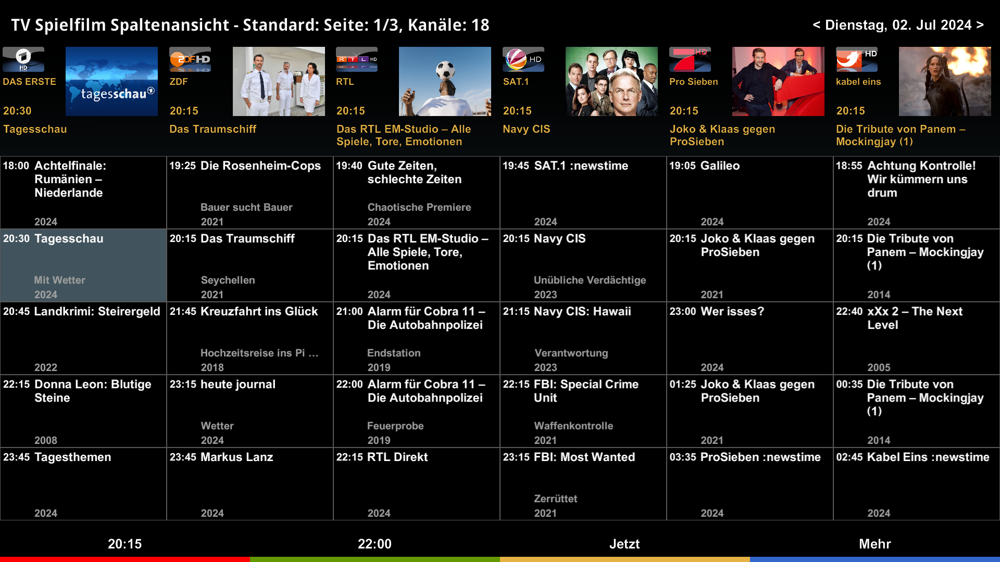
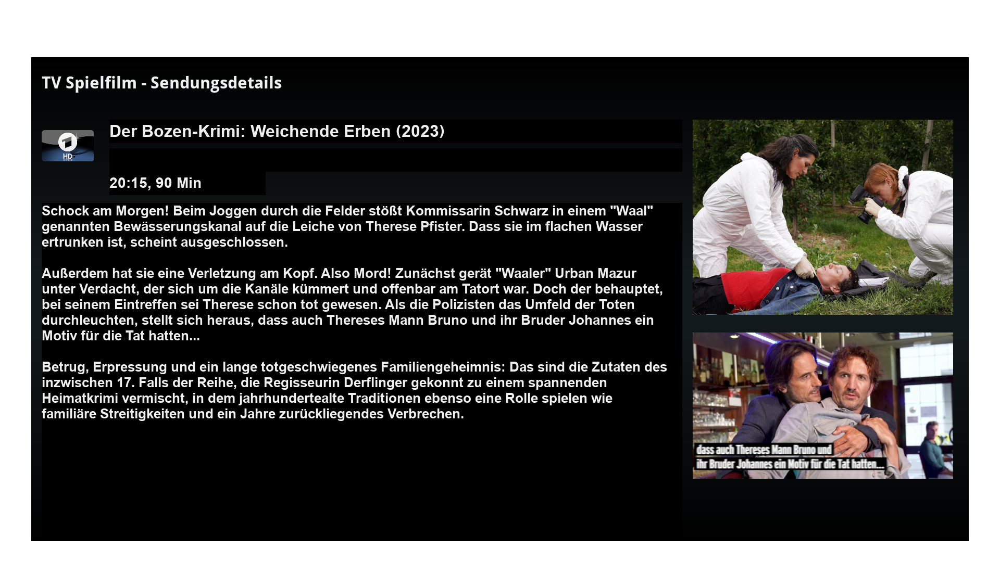

# TVMagazineCockpit (TVC)

DreamOS plugin to browse TV magazine(s)

## Features
- Displays event data
- Supports bouquets (favorites, sky, etc.)
- Integrates zap and add timer functions
- Allows mediathek downloads (if plugin MediathekCockpit is installed)
- Provides additional TMDB event information (if plugin TMDBCockpit is installed)
- Uses JSON interface to fetch data from content provider (instead of html page parsing)
- Supports HD, FHD, and WQHD skin resolutions.

## Languages
- english
- german

## Links
- Installation: https://dream-alpha.github.io/TVMagazineCockpit
- Support: https://github.com/dream-alpha/TVMagazineCockpit/discussions
- Package feed: https://gemfury.com/dream-alpha
