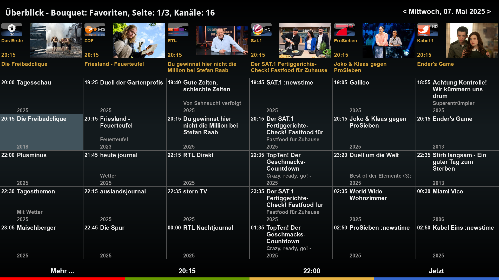
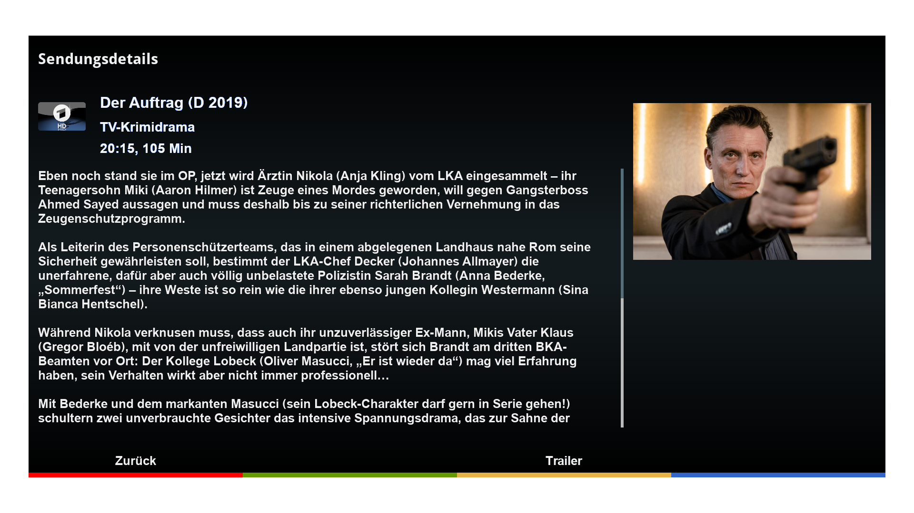

# TVMagazineCockpit (TVC)

DreamOS plugin to browse TV magazine(s)

## Features
- Displays magazine event data for current Enigma2 bouquet
- Integrates zap and add timer functions
- Allows mediathek downloads (if plugin MediathekCockpit is installed)
- Provides additional TMDB event information (if plugin TMDBCockpit is installed)
- Plays back trailer (if available)
- Supports HD, FHD, and WQHD skin resolutions.

## Languages
- english
- german

## Links
- Installation: https://dream-alpha.github.io/TVMagazineCockpit
- Support: https://github.com/dream-alpha/TVMagazineCockpit/discussions
